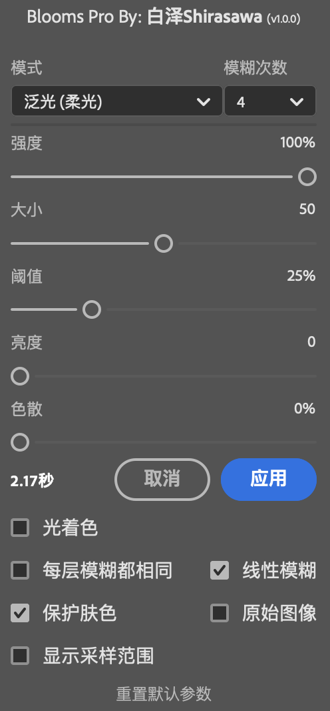
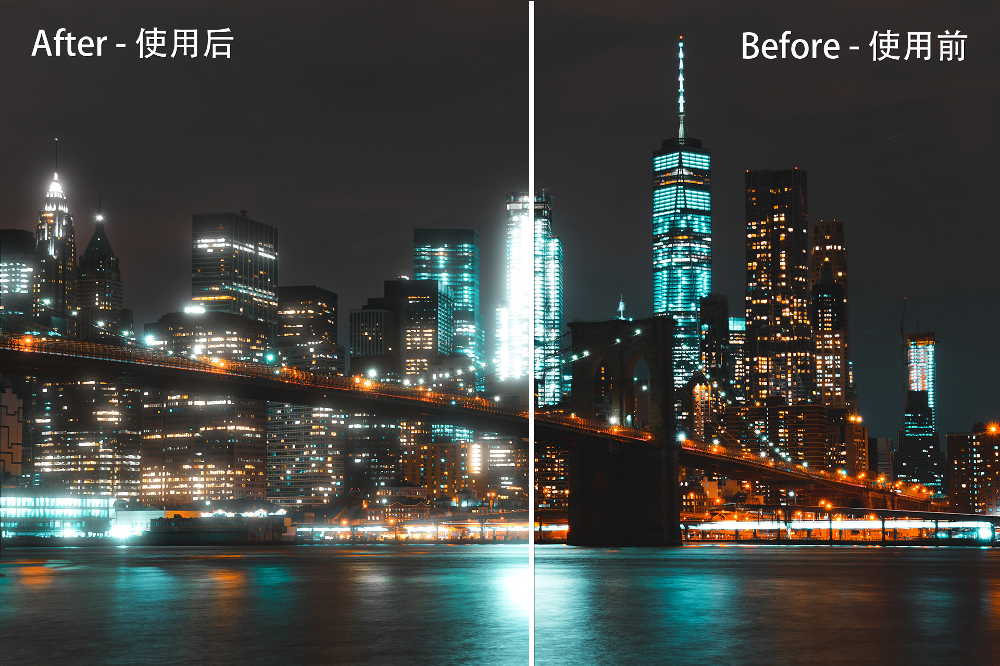

# Blooms Pro

Easily create glow effects in Photoshop.

在 PS 中轻松创建泛光与柔焦效果

## Features - 特性

- Mac M1 support - 原生支持 Mac M1 芯片
- Free and open source - 免费开源
- Multi-Language support - 多语言支持
- Multiple lighting effects support - 多种光效支持 (泛光、柔光泛光、线性光)
- Colorize support - 支持光着色
- Faster than other similar plugins - 比其他同类插件更快 (Mac M1: 0.5s vs 1.5s)
- More options - 更多选项 (e.g. 模糊层数、线性模糊、色散等)

## Usage - 如何安装

You should download the [Blooms-Pro.ccx](https://github.com/ShirasawaSama/Blooms-Pro/releases/latest/download/Blooms-Pro.ccx) file first.

### Method 1: One Click Installer - 方法一: 安装包

Just run the ccx file. That's all.

直接双击运行即可. **(需要正版 PS)**

### Method 2: Unzip - 方法二: 手动解压

1. Unzip the ccx file - 将下载到的 ccx 文件直接解压为一个文件夹
2. Move the unzipped folder to the Photoshop `Plug-ins` folder - 把解压到的文件夹直接复制到 PS 安装目录下的 `Plug-ins` 文件夹中并重启 PS

## Author

Shirasawa

## License

[AGPL-3.0](LICENSE)
