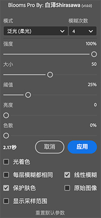

# Blooms Pro

Easily create glow effects in Photoshop.

在 PS 中轻松创建泛光与柔焦效果

## Features - 特性

- Support Photoshop 2022+ - 支持 Photoshop 2022 及以上版本
- Mac M1 support - 原生支持 Mac M1 芯片
- Free and open source - 免费开源
- Multi-Language support - 多语言支持
- Multiple lighting effects support - 多种光效支持 (泛光、柔光泛光、线性光)
- Colorize support - 支持光着色
- Skin color protection - 支持保护肤色
- Faster than other similar plugins - 比其他同类插件更快 (Mac M1: 0.5s vs 1.5s)
- More options - 更多选项 (e.g. 模糊层数、线性模糊、色散等)

## Usage - 如何安装

### Method 1: One Click Installer - 方法一: 安装包 **(需要正版 PS)**

1. Download the [Shirasawa.BloomsPro.ccx](https://github.com/ShirasawaSama/Blooms-Pro/releases/latest/download/Shirasawa.BloomsPro.ccx) file - 下载 [Shirasawa.BloomsPro.ccx](https://github.com/ShirasawaSama/Blooms-Pro/releases/latest/download/Shirasawa.BloomsPro.ccx)
2. Just run the ccx file. - 双击运行即可

### Method 2: Unzip - 方法二: 手动解压

1. Download the [Shirasawa.BloomsPro.zip](https://github.com/ShirasawaSama/Blooms-Pro/releases/latest/download/Shirasawa.BloomsPro.zip) file - 下载 [Shirasawa.BloomsPro.zip](https://github.com/ShirasawaSama/Blooms-Pro/releases/latest/download/Shirasawa.BloomsPro.zip)
2. Unzip the zip file - 将下载到的 zip 文件直接解压为一个文件夹
3. Move the unzipped folder to the Photoshop `Plug-ins` folder - 把解压到的整个文件夹直接复制到 PS 安装目录下的 `Plug-ins` 文件夹中并重启 PS

> For **PS2022**, please download the [Shirasawa.BloomsPro.PS2022.zip](https://github.com/ShirasawaSama/Blooms-Pro/releases/latest/download/Shirasawa.BloomsPro.PS2022.zip)
>
> 对于 **PS2022** 版本, 请下载 [Shirasawa.BloomsPro.PS2022.zip](https://github.com/ShirasawaSama/Blooms-Pro/releases/latest/download/Shirasawa.BloomsPro.PS2022.zip)

## Author

Shirasawa

## License

[AGPL-3.0](LICENSE)
